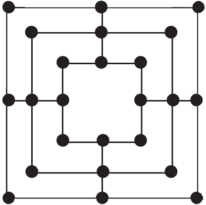

██╗     ██╗███╗   ██╗███████╗    ██╗   ██╗██████╗     ██████╗                                                                                          
██║     ██║████╗  ██║██╔════╝    ██║   ██║██╔══██╗    ╚════██╗                                                                                         
██║     ██║██╔██╗ ██║█████╗      ██║   ██║██████╔╝     █████╔╝                                                                                         
██║     ██║██║╚██╗██║██╔══╝      ██║   ██║██╔═══╝      ╚═══██╗                                                                                         
███████╗██║██║ ╚████║███████╗    ╚██████╔╝██║         ██████╔╝                                                                                         
╚══════╝╚═╝╚═╝  ╚═══╝╚══════╝     ╚═════╝ ╚═╝         ╚═════╝                                                                                          
                                                              

# LineUp_3

Est un jeu de plateau consistant à aligner trois pions.

## But du jeu

Former des alignements de trois pions. C'est à dire ? 
Elle doivent être visuellement liée, c'est à dire, elles doivent formée une droite.

## Comment se joue-t-il ?

Il existe trois phrases :

### Préparation du jeu

Chaque joueur reçoit un nombre X de pion de même couleur. Le plateau est vide au départ du jeu.

### On pose les pions

Tous les pions doivent être posés avant de pouvoir jouer. Attention à ne pas perdre dès la première phase du jeu.

### On déplace les pions jusqu'à ce que la victoire...
### Ou la défaite.

## License
[IUT-A](http://www.iut-a.univ-lille.fr/)
